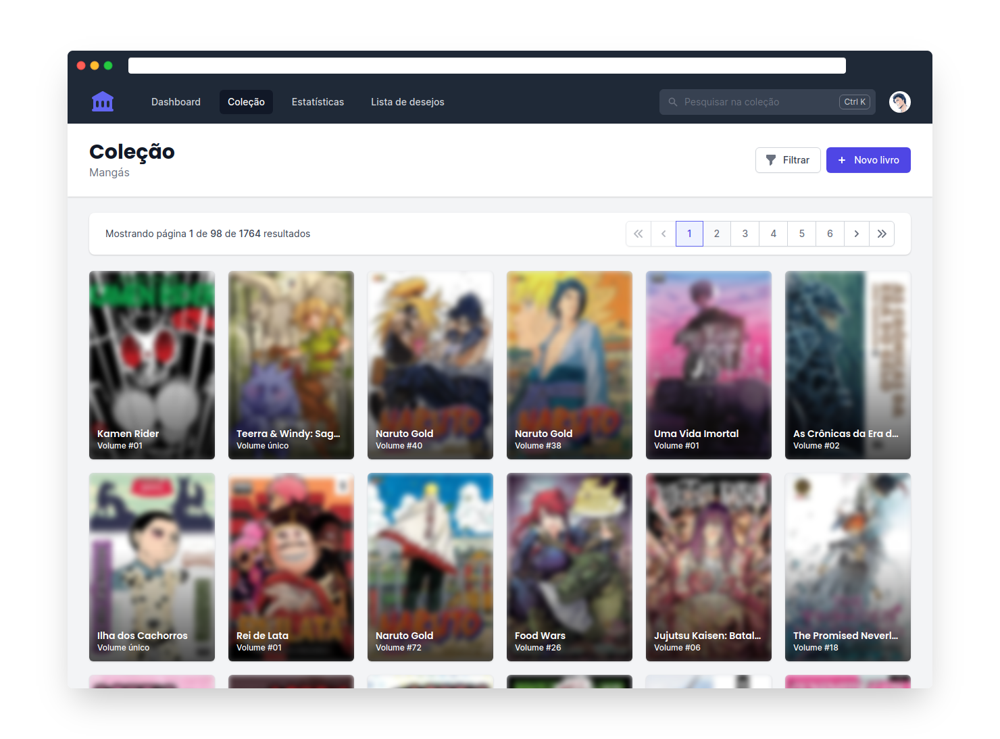

# Toshokan

Toshokan is a progressive web app on top of Google Sheets written 
in Vue.

It compiles in a static HTML that works great on mobile and can 
be deployed anywhere.

<p align="center">
  
</p>

It was inspired by the [expenses](https://github.com/jakubgarfield/expenses)
by jakubgarfield, and it uses the Tailwind CSS for the UI.

## Features

- Fill required book information by ISBN (only Brazilian editions);
- Automatically get the cover image from Amazon or from the publisher site;
- Generate monthly statistics.

## Get started

You will need the most recent version of Node and a place to deploy
static HTML under a custom domain with support to HTTPS.

1. Copy this [sheet](#) to your Google Drive. After sign in, choose
   `File -> Make a copy...`.
2. Don't rename it. It should be named `Toshokan`.
3. Clone this repo, install the dependencies, setup the variables in `.env`
   and build the app.
   
   ```console
   $ yarn install && yarn build
   ```
4. Copy the content of `build` folder to your server.
5. That's it! You can start adding books now. 

## License

> You can check out the full license [here](LICENSE).

This repository is licensed under the terms of the **MIT** license.

